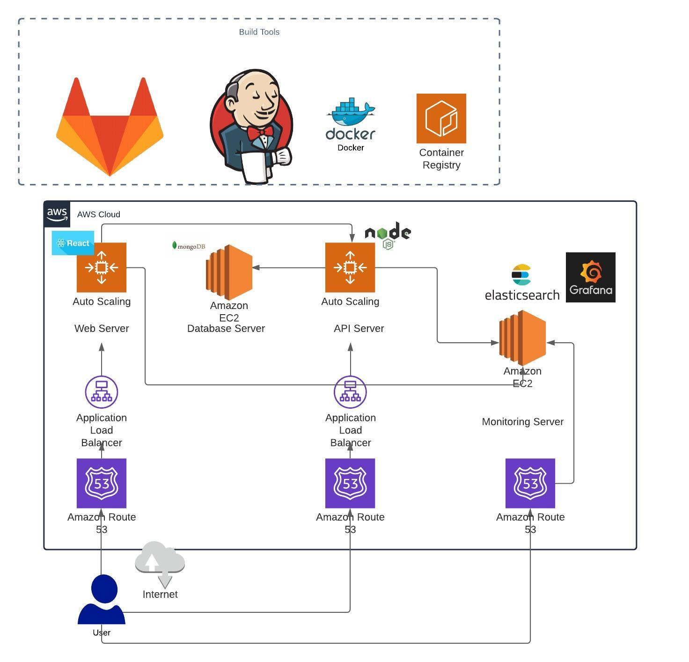

1. Architecture Diagram:
   
- 

2. Build

The Web and Api components of the application is built using a Nodejs docker image and is exposed on port 4100 and 3000 respectively.

3. Infrastructure

The Infrastructure for the application is built on AWS.

The Web component and the API component of the application are deployed on seperate infrastructures to provide highly available and fault tolerent system.

The Database component(mongodb) is built on AWS EC2 with data stored on EBS which is backed up on a regular basis.

4. Logging

Logging is managed within the monitoring cluster with the application and system logs from Web and Api stack being redirected to ELK stack running on the monitoring server.

5. Monitoring

System monitoring is enabled for all the nodes on Prometheus. Node exporters are installed on each nodes and are pulled by the prometheus agent running on the monitoring server. For visualization purposes, Grafana is installed as well.

| Application  | Port     | Stack      | Load Balanced? |     
| :---         | :---:    | :---:      |  :---:         |
| API          | 3000     | api        |   Yes          |
| Web          | 4100     | web        |   Yes          |
| Database     | 27017    | db         |   No           |
| Elasticsearch| 9200     | monitoring |   No           |
| Logstash     | 5044     | monitoring |   No           |
| Kibana       | 5601     | monitoring |   No           |
| Grafana      | 3000     | monitoring |   No           | 
| Prometheus   | 9000     | monitoring |   No           | 
| Node Exporter| 9100     | api and web|   No           | 

## Stack Features

1. Fully automated build and deployment process.
2. Monitoring and logging across all stacks.
3. High availablilty stacks.
4. Multi environment deployment capability.
